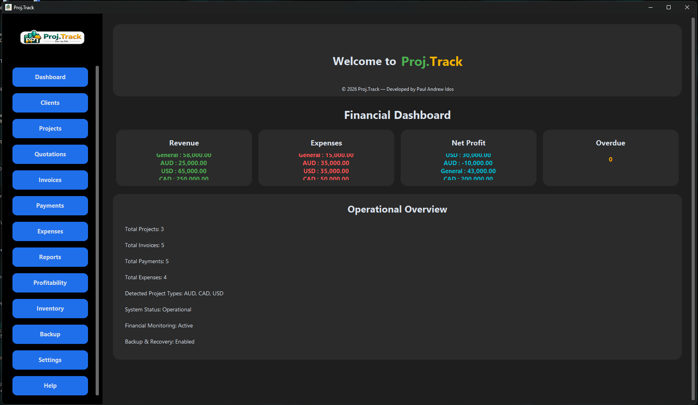
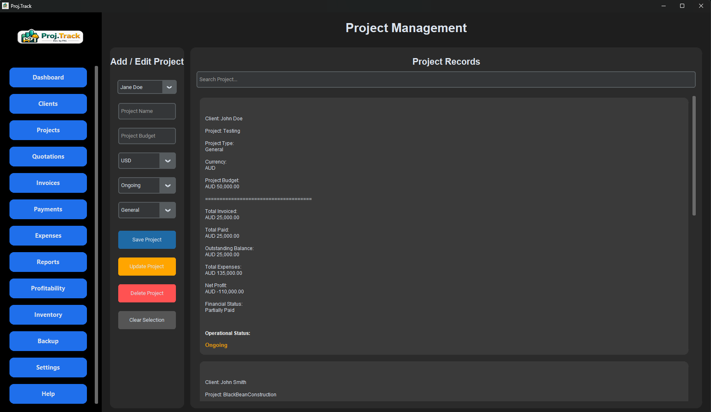
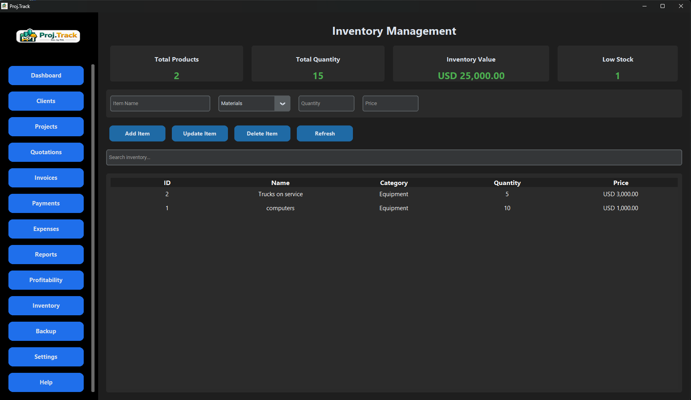
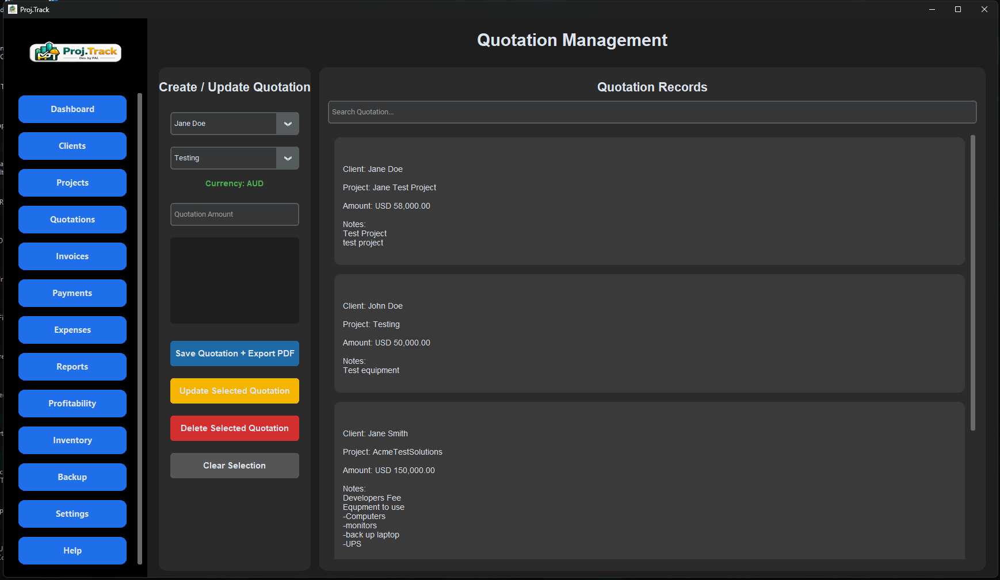
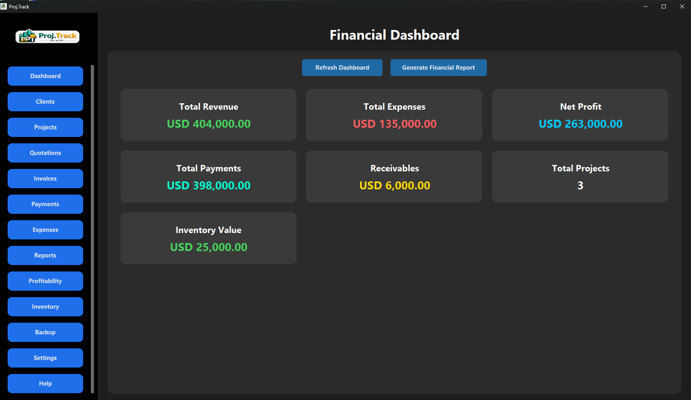
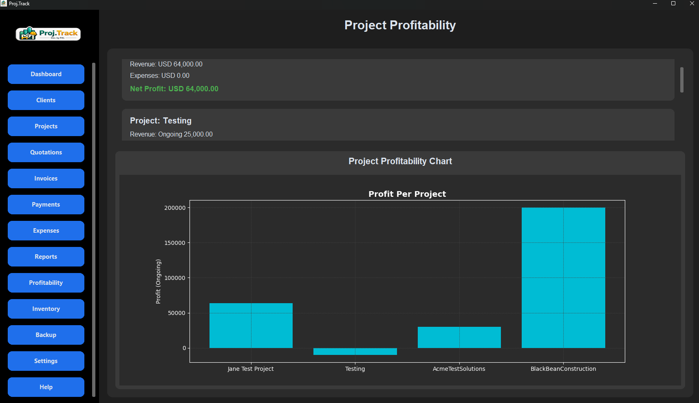

# Proj.Track ERP

Desktop ERP application built with Python, SQLite, and CustomTkinter featuring project management, inventory tracking, quotations, invoicing, profitability analysis, reporting, and PDF document generation.

## Overview

Proj.Track ERP is a desktop application designed to help small businesses manage projects, clients, quotations, invoices, inventory, expenses, profitability, and reporting from a single interface.

This project was developed as a personal software engineering portfolio project and practical ERP solution for small business operations.

## Copyright Notice

Copyright © 2026 Paul Andrew Idos. All rights reserved.

This repository is published for portfolio, educational, and demonstration purposes.

The source code may be viewed and evaluated through GitHub. No permission is granted to copy, modify, redistribute, sublicense, sell, or incorporate this software into other projects or commercial products without the express written permission of the author.

All intellectual property rights remain the property of the author.

If you are interested in licensing, purchasing, or collaborating on this project, please contact the author.

---

## Features

- Client Management
- Project Tracking
- Quotations
- Invoice Generation (PDF)
- Inventory Management
- Expense Tracking
- Profitability Analysis
- Financial Reports
- Backup and Restore
- License Management
- SQLite Database Backend

---

## Technology Stack

- Python
- SQLite
- Tkinter / CustomTkinter
- ReportLab
- Inno Setup

---

## Screenshots

### Dashboard



### Projects



### Inventory



### Quotations



### Reports



### Profitability



---

## Demo Video

Demo:

https://drive.google.com/file/d/1DNVqkQAmFSzPVq6DOGZ6gKMDDlszulEa/view?usp=sharing

---

## Installation

1. Clone the repository

```bash
git clone https://github.com/cybergh0st5/proj-track-erp.git